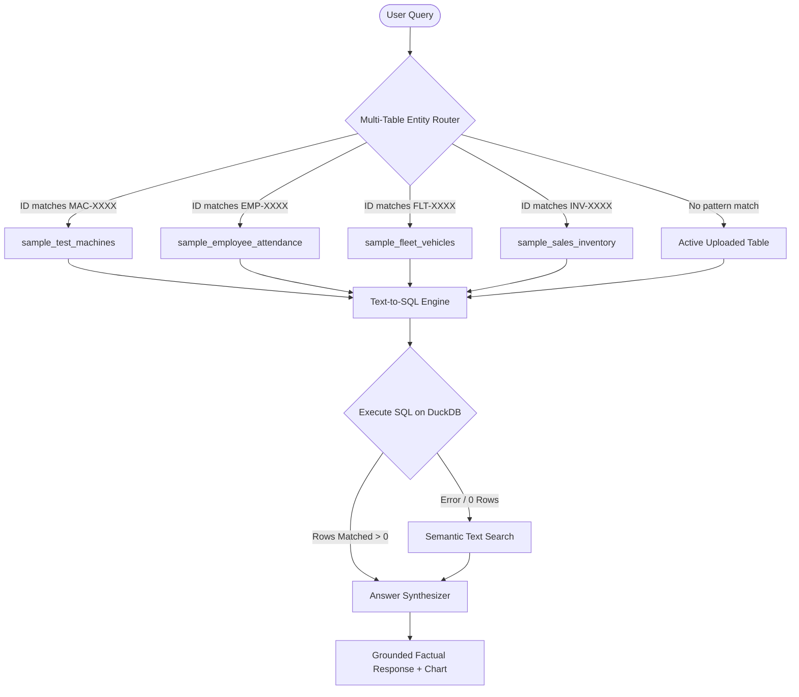

# Yash Technologies Data QA Studio

## 1. Project Objective
The **Yash Technologies Data QA Studio** is an enterprise-grade, **zero-hallucination** natural language Query and Analytics Engine. Its primary objective is to allow engineers, plant managers, and business operators to query complex databases and custom uploaded spreadsheets (Excel, CSV, JSON) using plain English/Hindi (Natural Language) and receive **100% mathematically accurate, ground-truth-verified answers** along with interactive visual analytics.

Traditional LLM chat applications suffer from hallucinations (inventing facts, miscalculating sums). This project solves this by separating **reasoning** (done by LLM SQL generation) from **computation** (executed deterministically on an in-memory DuckDB database), and validating all answers against the database engine.

---

## 2. Technical Stack
The system is built using a modern, lightweight, high-performance decoupled architecture:

### Backend (Python Service)
* **Web Framework**: FastAPI (high-speed ASGI server)
* **Database Engine**: DuckDB (in-memory columnar database optimized for analytical SQL queries)
* **AI Providers**: Swappable **Groq Cloud** (`llama-3.3-70b-versatile`) and **Gemini API** (`gemini-1.5-flash`)
* **Data Processing**: `pandas`, `openpyxl` (Excel parsing)
* **Server**: Uvicorn

### Frontend (SPA Web App)
* **Core**: React 18, TypeScript, HTML5
* **Build System**: Vite (ultra-fast bundler)
* **Styling**: Tailwind CSS & Vanilla CSS (supporting Dark/Light theme toggles)
* **Visualizations**: Recharts (interactive responsive SVG charts)
* **Icons**: Lucide React

---

## 3. System Architecture & Query Routing
The system follows a strict execution pipeline to prevent hallucinations:



### Steps in the Pipeline:
1. **Dynamic Data Ingestion**: When a user uploads a sheet, it is read into an in-memory DuckDB table.
2. **Auto-Profiling**: The profiler runs descriptive stats (count, averages, min/max, category distributions) and feeds them to the LLM to generate:
   * **3-4 Summary Insights**
   * **5 Dynamic Suggested Prompts**
3. **Multi-Table Entity Router**: Queries containing specific ID formats (like employee codes `EMP-102` or machine numbers `MAC-5003`) are automatically redirected to their correct target tables, even if the active uploaded sheet is different.
4. **SQL Generator**: Translates the query to a DuckDB SQL statement.
5. **Execution & Validation**: The SQL is run. If it fails or returns empty, the router fails over to the Semantic Keyword Engine to fetch the closest matched rows.
6. **Answer Synthesizer**: Formulates a conversational response backed strictly by the SQL query result.

---

## 4. How to Deploy

### Frontend Deployment on Vercel
Vercel is the recommended hosting platform for React/Vite SPAs.

#### Step 1: Prepare the code
Vercel will look at `frontend/` directory. We configure a `vercel.json` file in the frontend root to handle routing:
Create `frontend/vercel.json`:
```json
{
  "rewrites": [
    {
      "source": "/api/:path*",
      "destination": "https://yash-qa-backend.render.com/api/:path*"
    },
    {
      "source": "/(.*)",
      "destination": "/index.html"
    }
  ]
}
```

#### Step 2: Push to GitHub & Link to Vercel
1. Push the code repository to GitHub.
2. Go to [vercel.com](https://vercel.com) and click **Add New Project**.
3. Import the repository.
4. Set **Root Directory** as `frontend`.
5. Under Build Settings, verify:
   * **Framework Preset**: `Vite`
   * **Build Command**: `npm run build`
   * **Output Directory**: `dist`
6. Deploy!

---

### Backend Deployment (e.g., Render / Fly.io / AWS)
Since the backend uses a Python environment and maintains in-memory DuckDB tables, it requires a persistent or containerized runtime.

#### Option: Deployment on Render
1. Create an account on [Render.com](https://render.com).
2. Create a **New Web Service** and link your repository.
3. Configure the environment:
   * **Runtime**: `Python`
   * **Build Command**: `pip install -r backend/requirements.txt`
   * **Start Command**: `python -m uvicorn app.main:app --host 0.0.0.0 --port $PORT`
4. Under **Environment Variables**, add:
   * `GROQ_API_KEY`: `your_groq_api_key_here`
   * `GEMINI_API_KEY`: `your_gemini_api_key_here`
5. Click deploy. Copy the backend service URL and update the `vercel.json` API routing address to match it.
